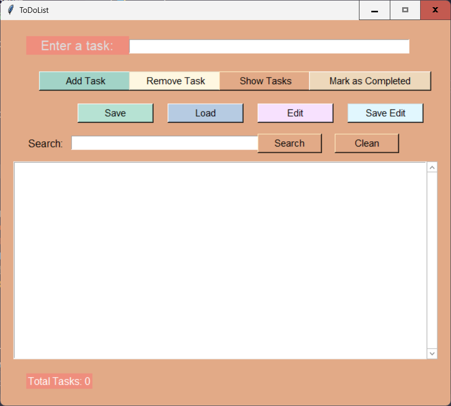

# ToDoList

A simple and user-friendly ToDo List application built with Python and Tkinter.

## Features
- Add, remove, edit, and mark tasks as completed.
- Save and load tasks (with their completed state) to/from a JSON file.
- Search tasks by text.
- Clean and organized graphical interface.
- Vertical scrollbar for easy navigation with many tasks.

## Screenshots




## Project Structure
```
ToDoList/
│
├── images/
│   ├── UI_image.png
│   └── UI_image1.png
├── src/
│   ├── main.py
│   ├── views/
│   │   └── gui.py
│   ├── functions/
│   │   ├── __init__.py
│   │   └── task_manager.py
│
├── tasks.json
├── requirements.txt   # No external dependencies required for now
├── README.md
├── LICENSE
├── .gitignore
└── venv/ (ignored by git)
```

## Requirements
- Python 3
- Tkinter (included in most standard Python installations)

## Installation & Usage
1. Clone the repository:
   ```sh
   git clone https://github.com/SMSPROGRAMACION1236/ToDoListApp.git
   ```
2. (Optional) Create and activate a virtual environment:
   ```sh
   python -m venv venv
   venv\Scripts\activate  # On Windows
   source venv/bin/activate  # On Linux/Mac
   ```
3. Install dependencies (Not Necessary, yet):
   ```sh
   pip install -r requirements.txt
   ```
4. Run the application:
   ```sh
   cd src
   python main.py
   ```

## Notes
- The `tasks.json` file is used to save and load your tasks.
- You can customize colors and layout in `src/views/gui.py`.
- If you want to contribute, feel free to fork and submit a pull request!

## License
MIT
